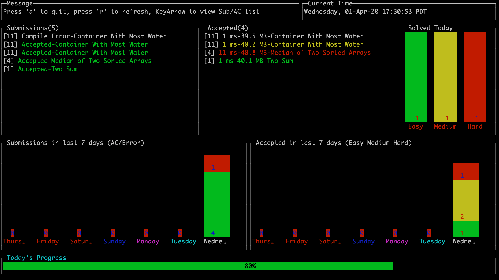

# LeetcodeDashboard


## Panel:

**Submissions:** Your Daily Submission Record (including multiple Submission for same problem)

**Accepted:** Your Daily Accepted Record (including multiple AC for same problem)

**Solved Today:** Your Daily AC of Easy, Medium, Hard problems. (Does not count multiple AC)

**Submission in last 7 days:** Including Multiple Submission On Same Problem

**Accepted in last 7 days:** Including Multiple AC On Same Problem


## Configuration:

Configuration file:

```json
{
    	"Cookie": "",
    	"CrawlIntervalSecond": 30,
    	"DailyGoal": 30,
    	"EasyScore": 1,
    	"MediumScore": 5,
    	"HardScore": 10,
    	"StartTimeOfTheNewDay": 2
}
```

**Cookie:** Your leetcode account browser cookie

**CrawlIntervalSecond:** Automatic refresh interval

**DailyGoal/EasyScore/MediumScore/HardScore** Each kind of problem has a score, add up them to meet your daily goal score. (Does not count multiple submissions on the same problem in a day)

**StartTimeOfTheNewDay:** Time to reset your daily data. Range [0-23]. For example, 2 means new day session would start at 2 am.

## Run:

```bash
git clone https://github.com/yangchenxi/LeetcodeDashboard

cd ./LeetcodeDashboard/bin/<yourOS>/<yourArc>

vim LCDashConfig.json #Config your cookie and other parameters

./lcdash LCDashConfig.json
```

## DataSource:

### ProblemInfo:

https://leetcode.com/api/problems/all/


### Submissions:

https://leetcode.com/submissions/#/1


(with cookie) https://leetcode.com/api/submissions/?offset=0&limit=20&lastkey=


## (For developer) TermUI library modification:

For barchart.go and stacked_barchart.go:

Add the following in Draw()
```go
	if maxVal == 0 {
		maxVal = 1
	}
```

https://github.com/gizak/termui/issues/245
